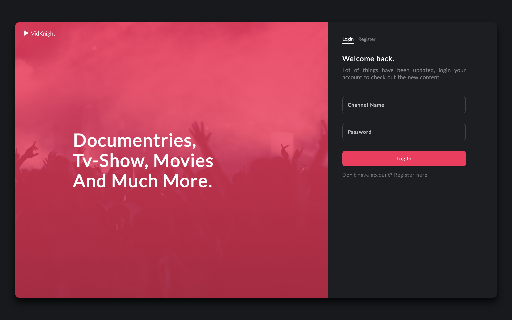
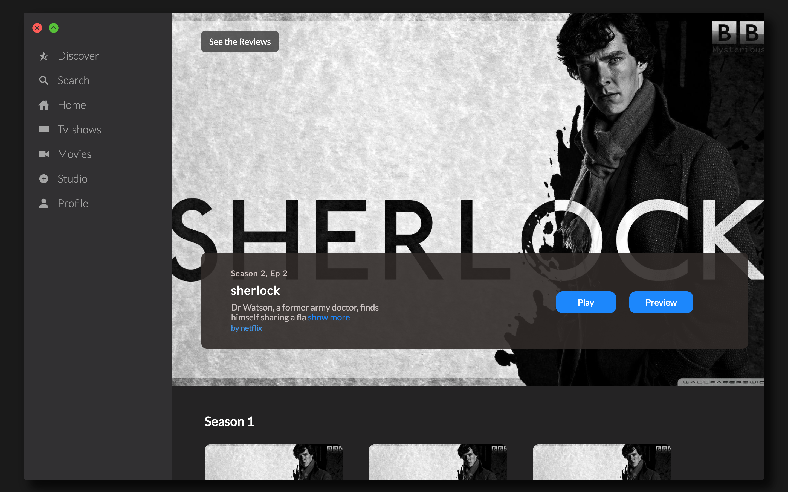
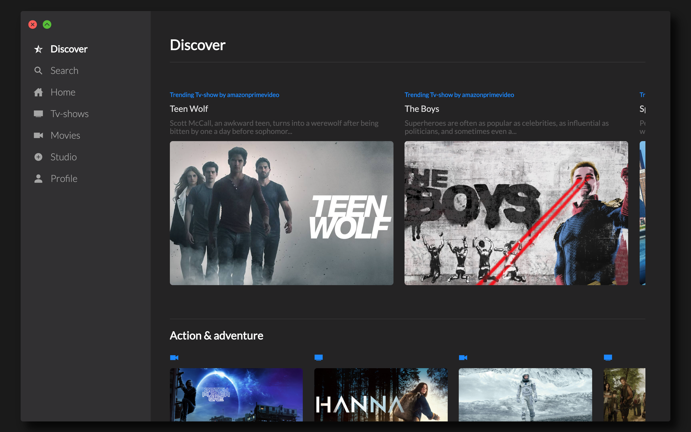
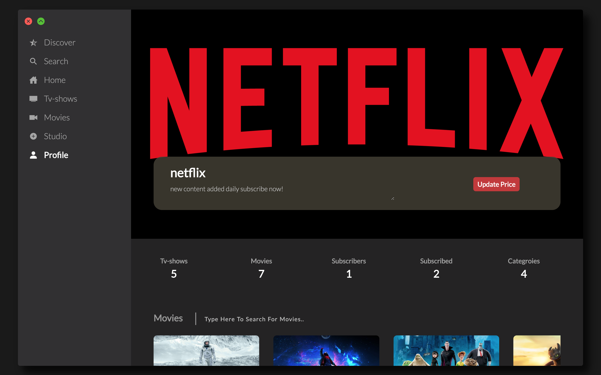
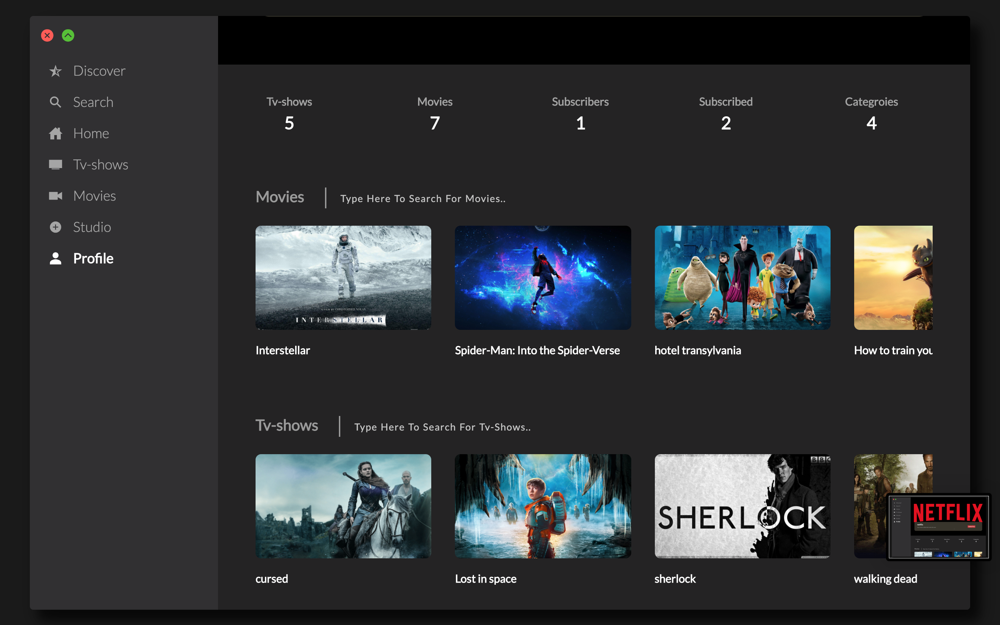

# vidKnight
vidKnight provides a service to make your own OTT Channel/Product like Netflix, amazonPrime, AppleTv etc

Note:
While making your database in mysql:- name your database as vidKnight and import the file vidKnight.sql given in the project 

ScreenShots of the Project

